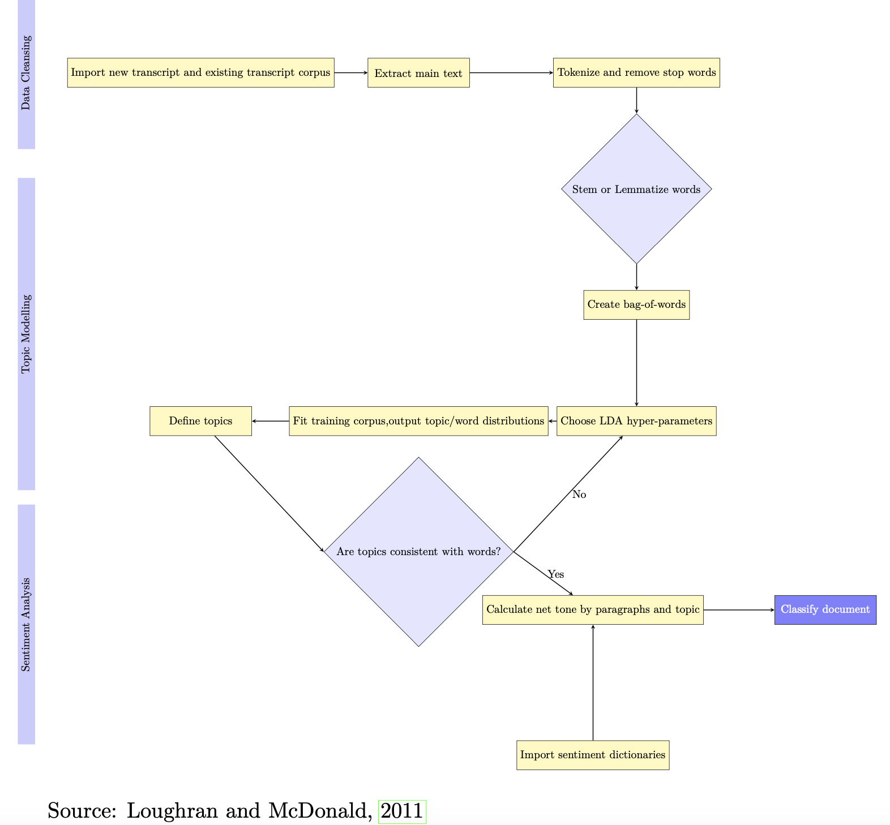
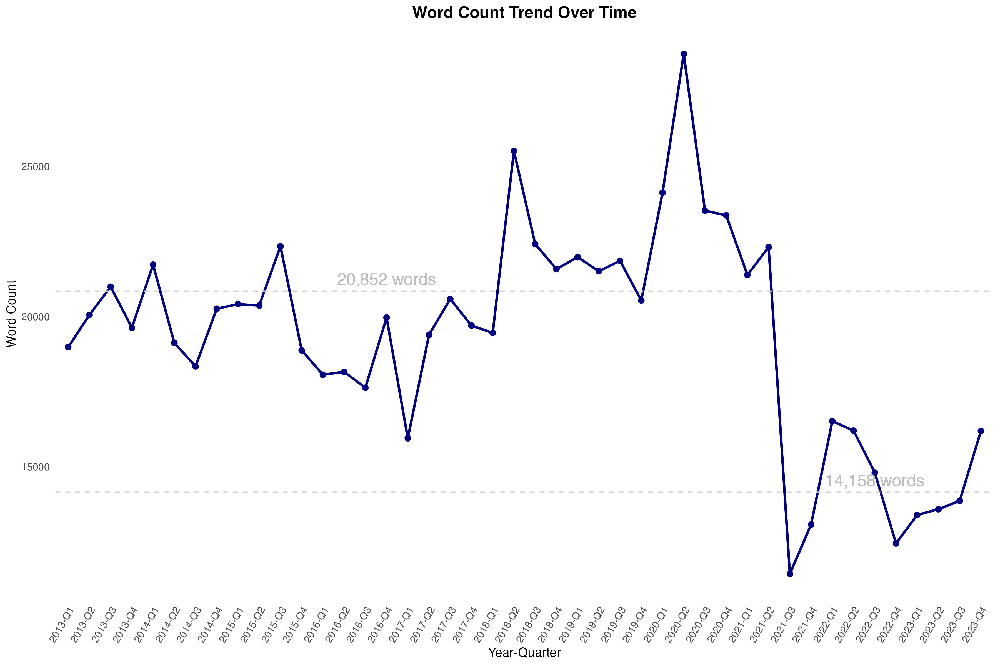
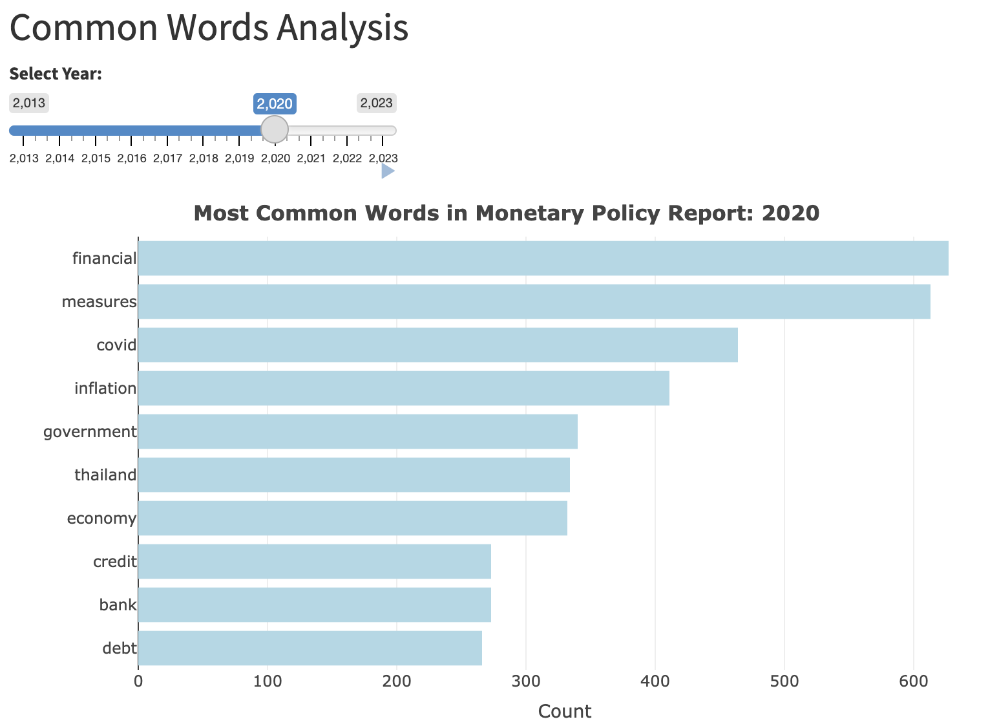
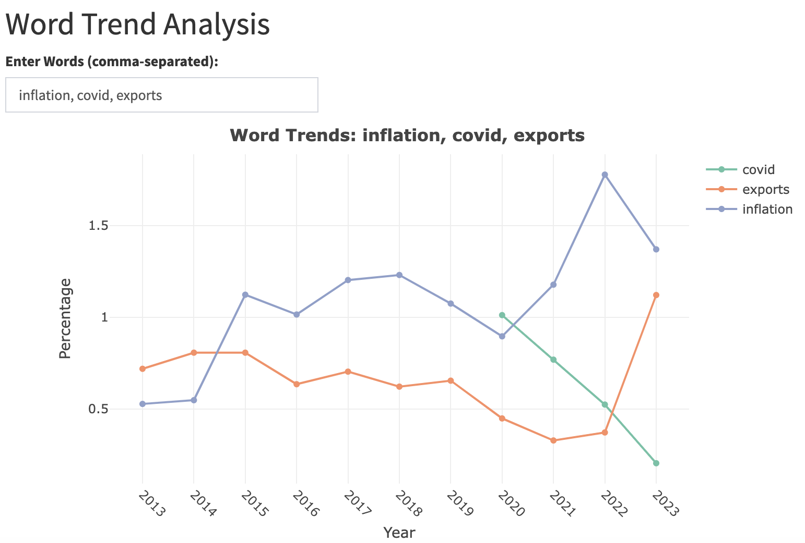
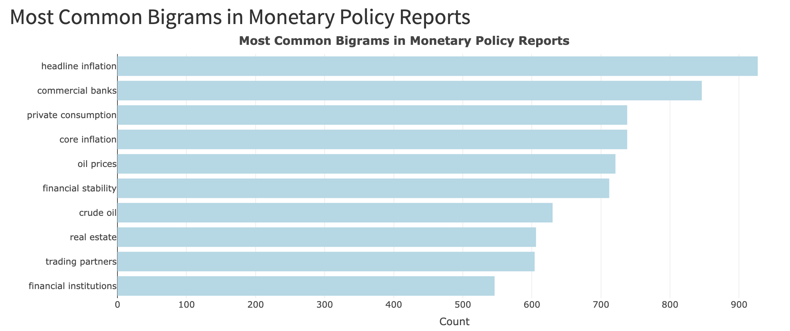
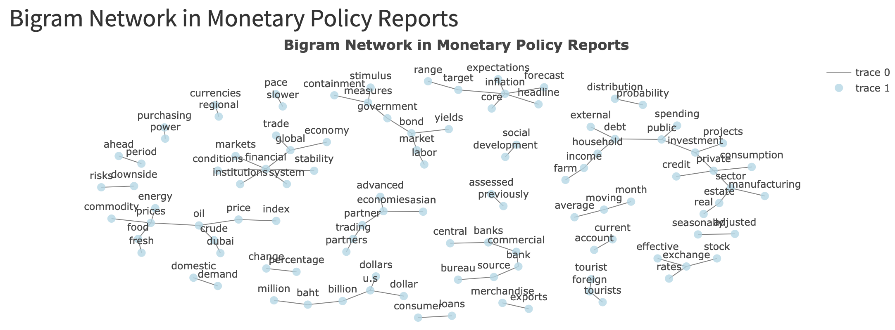
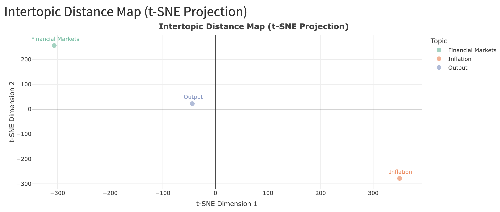
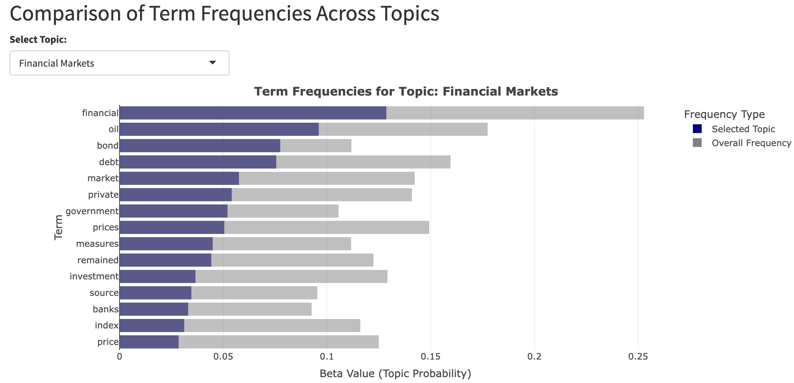

# Assignment 5: Interactive/Animated graphics 
Phornchanok (Paula) Tepkham\(March 5, 2025) \

This analysis is a part of master thesis, named "A More Robust Monetary Policy Shock: A Natural Language Processing Approach of Thailand’s Monetary Policy Reports"
---

## Directory
- Shiny App Link: [Monetary Policy Report: Text Analysis](https://phornchanokt.shinyapps.io/final_project_phornchanokt/)
- Data Preperation and Vizualization development: [R Markdown](final_project/prep_rds.Rmd)
- Shiny Code: [UI](final_project/ui.R), [Server](final_project/server.R)

## A More Robust Monetary Policy Shock: A Natural Language Processing Approach of Thailand’s Monetary Policy Reports

Research introduction: In order to study the real effect of monetary policy on the economy, the macroeconomists have to distinguish changes in interest rate from anticipated response to economic constrain and a anticipated move, since the surprised move the real monetary policy shocks. This paper purpose an identification approach for that monetary policy text shock, based on the idea that since the systematic changes can be estimated using measures of the central banks's information set, we can get the exogenous movements in interest rates. Endogenous and anticipatory movements may have led to underestimates of the effects pf monetary policy. In this paper, I purpose an identification approach. This approach captures both numerical and textual information in Central of Thailand documents on Monetary policy meetings. Since policy actions taken between meetings are often substantial and are usually based on the arrival of new information, the greenbook forecast for the previous meeting would likely to be a poor indicator of the information that led to the intermeeting action. I economically present that information from the documents released by staff contains information that staff's numerical forecasts do not incorporate. Therefore, including text-based information improves the Fed's mean expectation of interest rate for the improvement of the original Romer & Romer (2004) approach. Moreover, the estimate monetary policy shocks that are exogenous from both numerical and text information can be used to study macro variables.

The diagram shows three-step pipeline—spanning data preprocessing, topic modeling, and sentiment analysis—ensures that is utilized in this research. In this assignment I will use Shiny to create a support documents to show my analysis on 'topic modeling' part. 

 

## Tab 1 Overview : Text Processing Steps

I read raw text from each document into a computer and process it in the following steps.  Then, I remove stop words using [Loughran-McDonald's Stop Word List](https://sraf.nd.edu/textual-analysis/stopwords/), which includes general stop words, dates, numbers, and names. Then, I tokenize each document by breaking it into single words.

### Types of MPC Documents Used in Analysis

| Released after each meeting        | Released on a quarterly basis      |
|------------------------------------|------------------------------------|
| MPC Decision Announcement         | **Monetary Policy Report**         |
| **MPC Minutes**                   | Analyst Meeting Slides            |

### Word Count Trends in Monetary Policy Reports

The figure below illustrates the trends in the word count of the **Monetary Policy Reports** from 2013 to 2023.  
Over the decade, the **average word count per quarterly document** was approximately **20,852 words** before Q2 2021.  
However, a **significant reduction occurred after Q2 2021**, with word counts dropping to below **14,158 words**  
per document. This shift may indicate **changes in reporting style or content emphasis**, which warrants further investigation.

  

This figure highlights the declining word count in Monetary Policy Reports from 2013 to 2023, showing a sharp reduction after Q2 2021. This change may indicate a shift in policy communication, reporting style, or content emphasis. A line chart is the best choice for this time-series data, as it effectively captures trends and fluctuations. Dashed horizontal lines represent the average word counts before and after 2021, allowing for an easy comparison. Also, plotly’s interactivity helps storytelling by enabling hover tooltips, zooming, and panning, helping users explore specific time periods dynamically.

## Tab 2 Analysis 
### Subtab 2.1 Common words

On this Common words tab, these visualizations analyze word frequency and trends in Thailand’s Monetary Policy Reports (MPRs) over time. The bar chart highlights the most common words in a selected year, allowing users to see which terms were emphasized, while the line chart tracks the frequency of selected words across multiple years, revealing shifts in policy focus. For example, “COVID” appears prominently post-2020, reflecting the pandemic’s impact on monetary discussions, while terms like “inflation” and “financial” remain consistently relevant.

  
  

### Subtab 2.2 Common Bigrams

 
 

The bigram frequency bar chart and bigram network graph provide complementary insights into the language used in Monetary Policy Reports. The bar chart effectively highlights the most commonly used bigrams, allowing users to quickly compare word pair frequencies. A horizontal layout was chosen to accommodate longer phrases, ensuring readability. Using plot_ly(), the chart enhances user interaction by allowing hovering for exact values, making it easier to explore dominant economic terms over time. The bigram network graph, on the other hand, focuses on semantic relationships, revealing how words connect in the reports. This visualization uncovers clusters of related terms and highlights recurring themes in monetary policy discussions. The force-directed layout groups strongly associated words together, providing a clear structure. Interactive zooming, panning, and tooltips further enhance exploration. By combining these visualizations, users can analyze both the frequency and context of key economic terms, offering a comprehensive view of language trends in monetary policy.

### Subtab 2.3 Common Trigrams (to be updated)
### Subtab 2.4 Topic Modeling: LDA 

The topic modeling resulting from Thailand’s Monetary Policy Reports helps to understand key themes and word distributions across topics. The t-SNE projection scatter plot provides an intertopic distance map, visually representing how distinct or related topics are. Each topic is labeled for clarity, with color-coded markers enhancing differentiation. This form is effective because it allows users to quickly identify clustering and relationships between topics. The bar chart comparing term frequencies highlights key words within each topic compared to their overall usage. This enables users to see what makes each topic unique. The interactive dropdown selection lets users explore different topics dynamically.

 
  

Reference: 
- https://rstudio.github.io/shinythemes/ 
